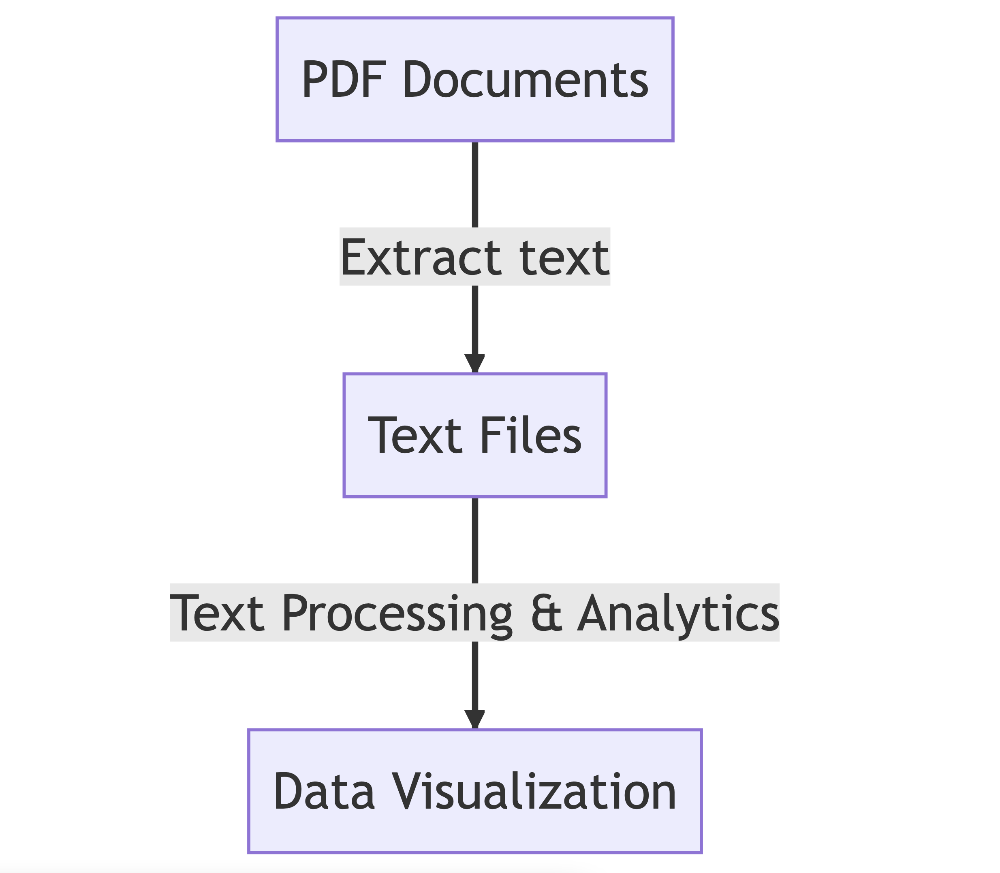

<!-- _class: lead -->
### Archives as Data
### Archiving Digital Records Workshop
---
# Thanks to our sponsor
[NEH Institutes for Advanced Topics in the Digital Humanities (IADTH)](https://www.neh.gov/grants/odh/institutes-advanced-topics-in-the-digital-humanities)

---
# And thanks to our organtizations....
* [Columbia Libraries](https://library.columbia.edu/)
* [History Lab](http://history-lab.org)  
---
# Orientation
* WiFi: select [Columbia University (Unsecure)](https://www.cuit.columbia.edu/cuit-wireless-network#:~:text=WiFi%20access%20is%20available%20to,option%20%E2%80%9CColumbia%20U%20Secure%E2%80%9D).
* Restrooms
* Location
   * Lehman Suite, 406 International Affairs Building 
   * [International Affairs Building](https://operations.cufo.columbia.edu/content/international-affairs-building)
   * [Morningside Campus](https://cufo.columbia.edu/sites/default/files/content/morningsidemap_2015aug-7.pdf) 
---
# Daily Schedule
* 09:00 AM - 12:00 PM: Technical Sessions
  * combo of lecture & exercises
  * breaks every hour
* 12:00 PM - 12:30 PM: Break
* 12:30 PM - 02:30 PM: Lunch, Speaker and Discussion
---
# Introductions
* Name
* Role
* Affiliation
* Motivation/Goal/Something interesting
---
# Objectives for Technical Sessions
1. Learn more about PDFs
2. Get comfortable with the command line
3. Introduced to text analytics tools
4. Extract text form docs and apply text analytics
5. Be a more effective contributor on DH projects
   * DH = digital humanities
6. Gain awareness of shortcomings & pitfalls of tools & techniques
---
# Target Processing Workflow

---
# Technical Sessions: Pls keep in mind
* Inaugural voyage
* Mind the firehouse
* Ben is not archivist or historian, he's a technical person
* Active participation welcome