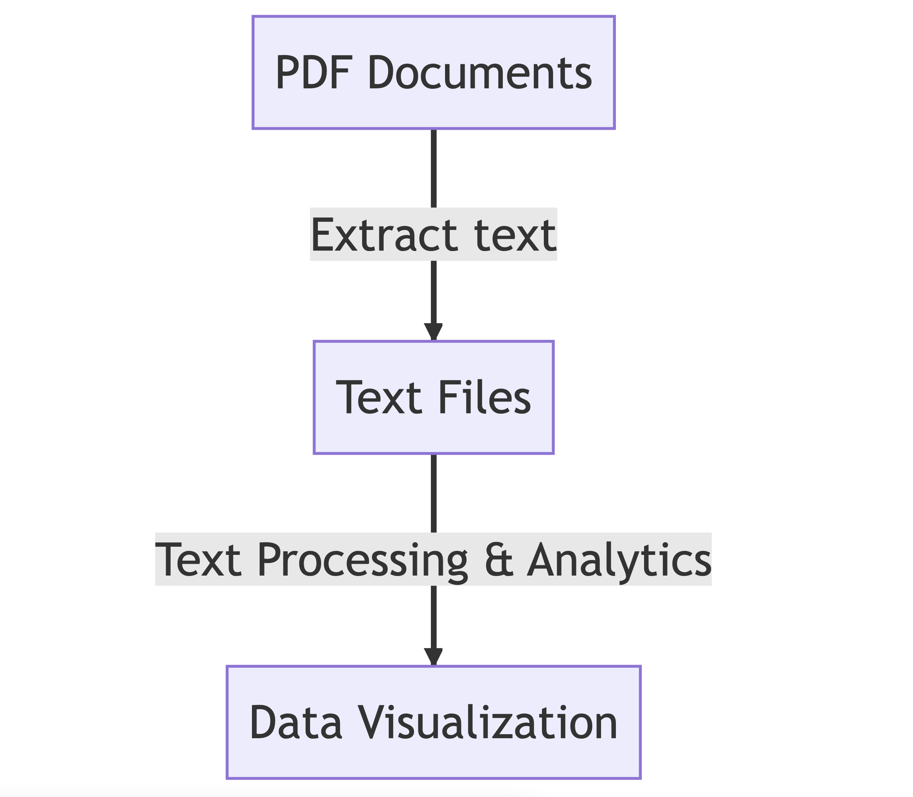

<!-- _class: lead -->
### Archives as Data
### Archiving Digital Records Workshop
---
# Thanks to our sponsor
[NEH Institutes for Advanced Topics in the Digital Humanities (IADTH)](https://www.neh.gov/grants/odh/institutes-advanced-topics-in-the-digital-humanities)

---
# And thanks to our organizations
* [Columbia Libraries](https://library.columbia.edu/)
* [History Lab](http://history-lab.org)  
---
# Orientation
* WiFi: select [Columbia University (Unsecure)](https://www.cuit.columbia.edu/cuit-wireless-network#:~:text=WiFi%20access%20is%20available%20to,option%20%E2%80%9CColumbia%20U%20Secure%E2%80%9D).
* Restrooms
* Location
   * Lehman Suite, 406 International Affairs Building 
   * [International Affairs Building](https://operations.cufo.columbia.edu/content/international-affairs-building)
   * [Morningside Campus](https://cufo.columbia.edu/sites/default/files/content/morningsidemap_2015aug-7.pdf) 
---
# Daily Schedule
* 09:00 AM - 12:00 PM: Technical Sessions
  * combo of lecture & exercises
  * breaks every hour
* 12:00 PM - 12:30 PM: Break
* 12:30 PM - 02:30 PM: Lunch, Speaker, and Discussion
---
# Introductions
* Name
* Role
* Affiliation
* Motivation/Goal/Something interesting
---
# Objectives for Technical Sessions
1. Learn more about PDFs
2. Get comfortable with the command line
3. Introduced to text analytics tools
4. Extract text form docs and apply text analytics
5. Be a more effective contributor to DH/IT projects
   * DH = digital humanities
6. Gain awareness of shortcomings & pitfalls
---
# Target Processing Workflow

---
# Technical Sessions: Pls keep in mind
* Inaugural voyage
* Active, point-in-time participation welcome
* The firehouse
* Ben is not an archivist or historian. He's a technical person
