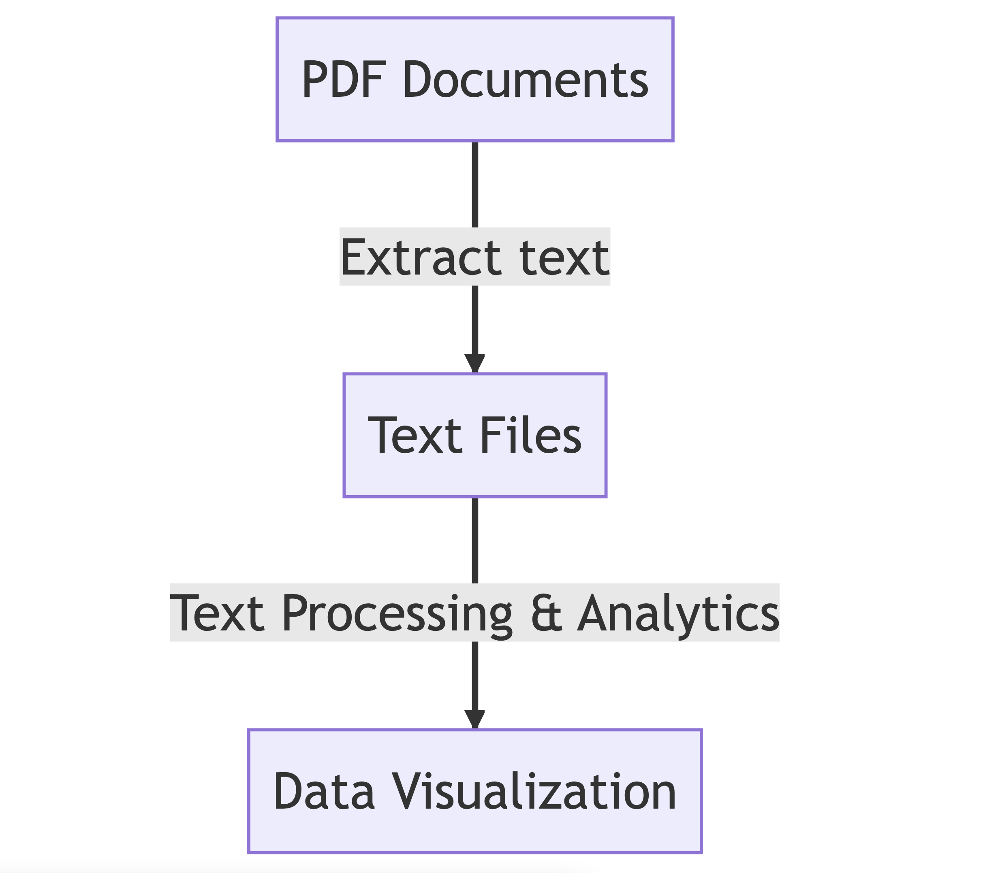

<!-- _class: lead -->
# Archives as Data 2024
## Archiving Digital Records Workshop
---
# Thanks to our
* sponsor: 
  * [NEH Institutes for Advanced Topics in the Digital Humanities](https://www.neh.gov/grants/odh/institutes-advanced-topics-in-the-digital-humanities)

* organizations:
  * [Columbia Libraries](https://library.columbia.edu/)
  * [History Lab](http://history-lab.org)  
---
# Orientation
* wifi: `Columbia University`
* restrooms
* location
   * Lehman Suite, 406 International Affairs Building 
   * [International Affairs Building](https://operations.cufo.columbia.edu/content/international-affairs-building)
   * [Morningside Campus](https://cufo.columbia.edu/sites/default/files/content/morningsidemap_2015aug-7.pdf) 
---
# Daily Schedule (Week 1)
* 09:00 AM: Meet in front of the gates at 116th and Broadway
* 09:30 AM-11:55 AM: Technical Lecture & Exercises
* 12:00 PM-01:00 PM: Lunch & Speaker
* 01:00 PM-02:00 PM: Discussion with speaker
* 02:00 PM-03:00 PM: Lab or reading discussion
---
# Daily Schedule (Week 2)
* 12:00 PM-01:00 PM: Lunch & Speaker
* 01:00 PM-02:00 PM: Discussion with speaker
---
# Introductions
* Name
* Role
* Affiliation
* Motivation/Goal
---
# Objectives for Technical Sessions
1. Gain PDF knowledge
2. Get comfortable with the command line
3. Introduced to text analytics tools
4. Extract text from PDFs and apply text analytics
5. Become a more effective team member on DH/IT projects
   * DH = digital humanities
6. Be more willing to try DIY projects
7. Gain awareness of shortcomings & pitfalls
---
# Target Processing Workflow

---
# Technical Sessions: Pls keep in mind
* 2nd time giving this workshop
* Active, point-in-time participation welcome
* The firehose
* Ben is not an archivist or historian. He's a technical person
