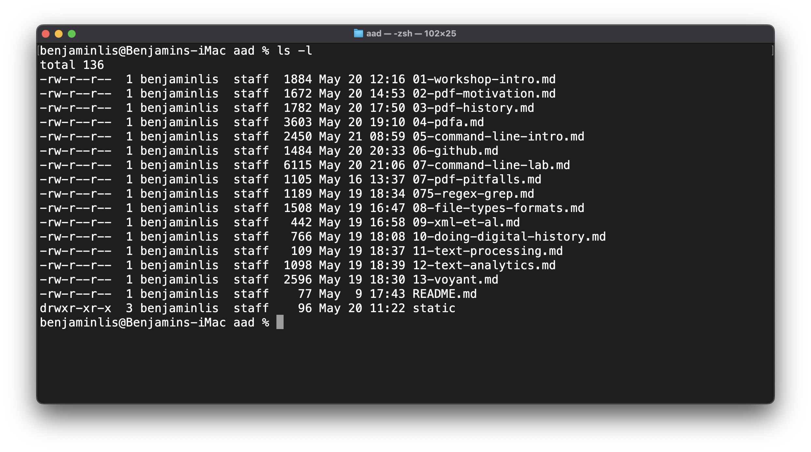

<!-- _class: lead -->
# Introduction to the command line
---
<!-- _class: lead -->
# A course objective:
## To get comfortable on the command line
### But why?
---
# Reasons to learn the command line
* Access to software only available on the command line
* Gain access to powerful capabilities:
     * process N files as easily as one
     * run a sequence of programs as easily as one
     * redirect the output from one program to use as input to another
* High return on time invested
* Pre-req for productive programming
---
# OK, what is the command line?
* Textual interface to the computer
* User inputs commands via keyboard and receives text output
* "command line" and "terminal" are used interchangeably

---
# Shell
* Program that provides the command line
* Interface between the user and operating system

---
# Bash
* Many command line [shell programs](https://en.wikipedia.org/wiki/Unix_shell)
* Most are very similar and provide a command (aka scripting) language
* We're using `bash` (Bourne Again SHell)
   * most popular shell
   * available on Windows/Mac/Linux 
---
# Your notebook and the command line
* You can access the command line on your notebook
* Differences (typically minor) across platforms and versions
* Different notebooks: different memory, disk space, SW versions
* Good chance of idiosyncratic issues arising 
     * especially when installing software
* Impairs the initial learning experience
---
# GitHub Codespaces for the exercises
* Eliminates issues described on the previous slide 
* Everybody gets an individual but identical environment
* Don't need to install SW on notebook
* Get exposure to GitHub and cloud computing
* Gateway to further training with [LinkedIn Learning](https://www.linkedin.com/learning/topics/hands-on-practice-with-github-codespaces)
* Friday, you'll get a chance to install the tools on your notebook
---
# Tasks
* Sign up for a GitHub account [here](https://github.com/join) if you don't already have one
* (Optional) If you haven't already signed up for access to one of:
    * chatGPT
    * Bing Chat
    * Google Bard